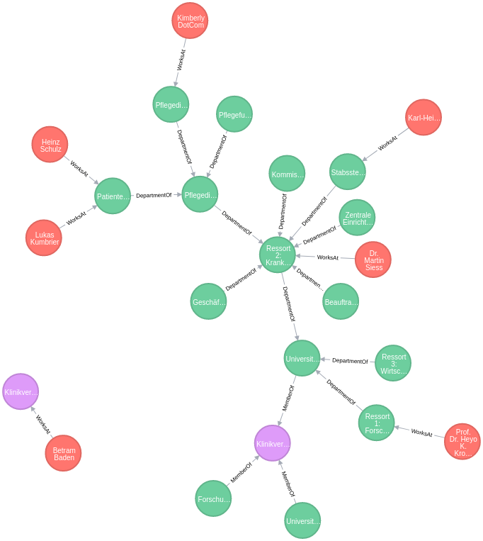

# What is this about?

This repo contains an evaluation of neo4j and the integration with node.js.

# Example Graph

This repo works with an example graph that contains nodes of types

- OU (Organizational Units)
- Person (e.g. Employees)
- Federation (Aggregation of OUs)

The example case contains the Universitätsmedizin Göttingen with some departments and sub-departments and Persons working in those Departments. There are two other clinics that have no relation to the Universitätsmedizin Göttingen but are aggregated together with it in a Federation called 'Klinikverband Niedersachsen'. Another Federation ('Klinikverband Baden-Württemberg') exists in parallel and has a single Employee.

The example graph is stored in `data.cql`, some example queries can be found in `queries.cql`.



# Run

Start up a docker neo4j docker container and load an example graph into it by running
```bash
$ ./run.sh
```

When the container is running, run

```bash
$ node example.js
```
to run an example query against the example graph that fetches all employees of all federations.

# Findings

- use neo4j in a version that contains the cypher-shell as it is way better than the deprecated neo4j-shell (especially when it comes to multiline queries)
- node.js can be integrated with easily through the neo4j-driver
- it is possible to load CSV data by mapping it to nodes and relations